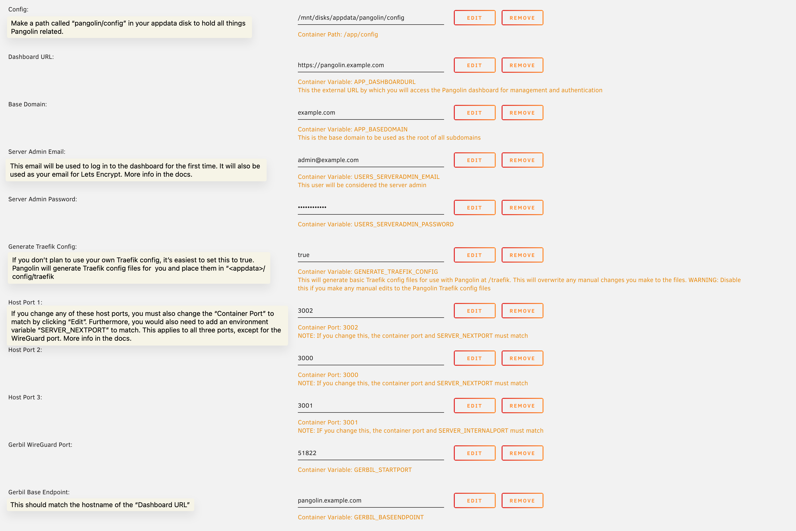
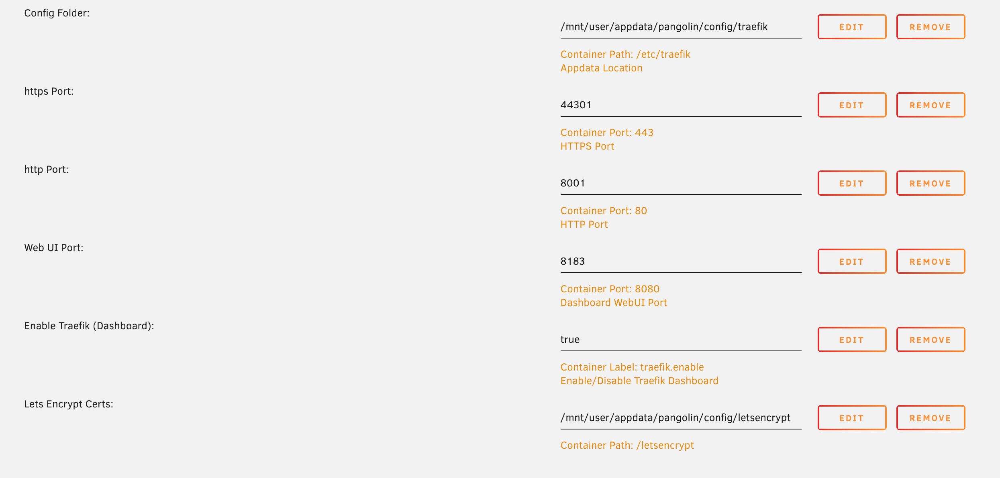

import StaticTraefikConfig from "@site/src/components/StaticTraefikConfig";
import DynamicTraefikConfig from "@site/src/components/DynamicTraefikConfig";

# Unraid

:::warning

Installing Pangolin, Gerbil, and Traefik on Unraid assumes you are able to port forward on the network running these servers. If you're behind CGNAT, install Pangolin a VPS and install Newt on your Unraid server to bypass the port forwarding restriction.

**If you just want to install Newt on Unraid, and have no interest in running Pangolin and its components, there is a Newt container available in the Community Apps store. See the Newt install instructions for Unraid [here](https://docs.fossorial.io/Newt/install#unraid).**

:::

:::note

You can use an existing Traefik installation should you have one, but it will require more manual/custom configuration. This guide will focus on setting up Traefik from scratch to work with our system, but you're free to modify the Traefik configuration as much as you'd like.

:::

The first part of this tutorial will explain how to use Pangolin and Traefik as a local reverse proxy without Gerbil and its tunneling features. The second (optional) part will expand on this and show how to enable tunneling by setting up Gerbil.

All containers are available in the Unraid Community Apps (CA) store. If you're not familiar with Unraid, you can find more information on their [website](https://unraid.net/).

This installation has a lot of moving parts and is a bit non-standard for Unraid because Pangolin and its components were designed to run as micro-services on a VPS in tunneling mode. However, some may want to use "Local" reverse proxying on their Unraid server or use their Unraid server as a tunnel controller with Gerbil. For either of these use cases, follow the steps outlined in this guide.

## Prerequisites

- A working Unraid server.
- A domain name with access to configure DNS and the ability to port forward on your network.
  - The networking is the same as for the VPS, just on your local network, so please refer to [Networking page](https://docs.fossorial.io/Getting%20Started/dns-networking) for more info.

## Create a Docker Network

Before starting, create a new docker network on Unraid. This will simplify things, and allow the containers to communicate with each other via their container names. If you already have a network, there is no need to create another one. 

1. Open the web terminal in Unraid
2. Run the following command:

_You can use any name you want for the network. We will use `mynetwork` in this guide._

```bash
docker network create mynetwork
```

For more info on this, see this [tutorial by IBRACORP](https://www.youtube.com/watch?v=7fzBDCI8O2w).

## 1. Setup Pangolin and Traefik

This first part will enable Pangolin to work in "Local" reverse proxy mode. Newt and WireGuard will **not** be able to be used after finishing this first part. However, if you want to use those features, you still need to follow this first part of the tutorial because we show how to set up Pangolin and Traefik first.

### Install and Setup Pangolin

#### 1. Create the Config Files 

Pangolin uses a yaml file for configuration. If this is not present on start up, the container will throw an error and exit.

Create a `config.yml` file in the `config` folder.

See the [Configuration](https://docs.fossorial.io/Pangolin/Configuration/config) section for what to put in this file.

```
pangolin/
├─ config/
│  ├─ config.yml
```

#### 2. Install Pangolin via the CA Store

#### 3. Configure Pangolin

Set the network to the one you created earlier.

<p align="center">
    
</p>

Server Admin Email and Password:

The server admin email is mainly used to set up the first "Server Admin" account which you will use to log in for the first time. These values will override anything you set in the config file.

Ports:

Due to the way Pangolin was designed to work with docker compose and a config file, the way it handles ports is a little different as compared to other popular Unraid containers. For all host ports:

The host ports, container ports, and ports in the config should match for simplicity. This is because the Pangolin config also has ports in it. If you decide to use a non-default port, you would need to edit the port in the template and the config file.

For example, to change the port for the WebUI:

- Click edit on the port
- Set the "Container Port" to the new port you want to use
- Set the "Host Port" to the new port you want to use
- Edit Pangolin's config file and set server.next_port to the new port you want to use

#### 4. Start the Pangolin Container

:::warning

Pangolin will not start without a config file. If you have not created the config file or the config file is invalid, the container will throw an error and exit.

:::

#### 5. Log in to the dashboard

Log in with the admin email and password you set earlier. Follow the setup steps.

- Create your first Organization
- Create your first "Local" site for local reverse proxying

### Install and Setup Traefik

Before starting with Traefik, shut down the Pangolin container.

#### 1. Create the Config Files

Update the appdata path with new files for Traefik. At this point there may be some extra files generated by Pangolin.

```bash
pangolin/
├─ config/
│  ├─ config.yml
# highlight-start
│  ├─ letsencrypt/
│  ├─ traefik/
│  │  ├─ dynamic_config.yml
│  │  ├─ traefik_config.yml
# highlight-end
```

`pangolin/traefik_config.yml`:

<StaticTraefikConfig />

`pangolin/dynamic_config.yml`:

<DynamicTraefikConfig />

#### 2. Install Traefik via the CA Store

This section will use the Traefik template from the "IBRACORP" repository. If you already have a Traefik installation running, you should manually configure your Traefik config to work with Pangolin.

<p align="center">
    
</p>

#### 3. Configure Traefik

<p align="center">
    
</p>

_Please refer to the official Traefik docs for more information on the Traefik configuration beyond this guide._

**Match your config to the one above. You will have to remove some of the default variables in the template that are not needed. You can always add them back if you need them later.**

Network Type:

Set the network type to the one you created earlier.

Post Arguments:

Tell Traefik where the config file is located by adding the following to the "Post Arguments" field. This is not the host path, but the path inside the container.

```bash
--configFile=/etc/traefik/traefik_config.yml
```

Config Folder:

If you're using the Traefik config generated by Pangolin, point this to the same appdata path as Pangolin, but append `/traefik`, like this: `<appdata>/config/traefik`.

Lets Encrypt (Host Path 2 in screenshot):

Traefik will store the certification information here. You can make this path anywhere you want. For simplicity, we're placing it in the same config path at `<appdata>/config/letsencrypt`.

Ports:

You will need to port forward the https and http ports listed in the config on your network's router.

#### 4. Port Forwarding

You will need to port forward the ports you set in the Traefik config on your network's router. This is so that Traefik can receive traffic from the internet. You should forward 443 to the https port and 80 to the http port you set in the Traefik config.

## 4. Add Gerbil for Tunneling (Optional)

:::note

If you do not want to use the tunneling feature of Pangolin and only want to use it as a local reverse proxy, you can stop here.

:::

Before setting up Gerbil, shut down Traefik and Pangolin.

If you plan to use tunneling features of Pangolin with Newt or WireGuard, you will need to add Gerbil to the stack. Gerbil is the tunnel controller for Pangolin and is used to manage the tunnels between the Pangolin server and the client.

Luckily, adding Gerbil is fairly easy. 

The important concept to understand going forward, is we need to network Traefik through Gerbil. All Traefik traffic goes through the Gerbil container and exits.

#### 1. Install Gerbil via the CA Store

#### 2. Configure Gerbil

Set the network to the one you created earlier.

<p align="center">
    
</p>

Important things to consider:

Internal Communication:

Anywhere you see `http://pangolin:3001` must match. The hostname should be the name of the Pangolin container on the docker network you're using. This is because it is routed using the internal docker DNS address. The port must also match the port you have set for the internal port in Pangolin. These defaults will work unless you changed these values earlier when setting up Pangolin.

WireGuard Port:

The port you use for WireGuard must also match what you set the port to in the Pangolin config. By default we use a slightly different port than the standard WireGuard port to avoid conflicts with the built in WireGuard server in Unraid.

HTTP and HTTPS Ports:

You must open these ports because Traefik will be routed through Gerbil. These ports should match the ports you set in the Traefik config earlier. In the next step, we will set the network mode for Traefik which which will close the ports on the Traeffik side, and prevent conflicts. Before doing this, if you start the Traefik container at the same time as the Gerbil container with the same ports mapped to the host, you will get an error.

#### 3. Network Traefik Through Gerbil

As discussed earlier we need to network Traefik through Gerbil. This is pretty easy. We will do all of this in the Traefik container settings.

Toggle advanced settings, and add the following to the "Extra Parameters" section. 

```bash
--net=container:Gerbil
```

Then, set "Network Type" to "None".

<p align="center">
    
</p>

#### 4. Start the stack

We recommend to start the whole stack in the following order:

1. Pangolin
2. Gerbil
3. Traefik

#### 5. Port Forwarding

You will need to port forward the WireGuard port you set in the Gerbil config on your network's router. This is so that the client can connect to the server.

#### 6. Verify Tunnels are Functional

Your logs for Gerbil should look something like this:

_You probably won't have the peer connection messages but in general, you should see the WireGuard interface being started._

<p align="center">
    
</p>

Log back into the Pangolin dashboard and create a new site with Newt or basic WireGuard. Copy the credentials to your client and connect. You should see the tunnel status change to "Online" after a few moments if the connection is successfull. Remember to also monitor the logs on the client and server.
