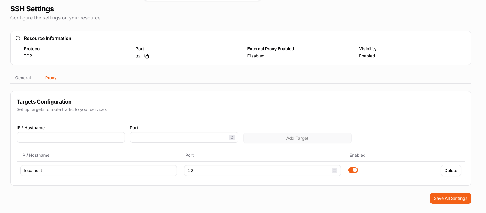
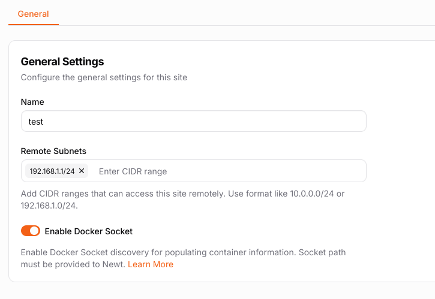

# Clients

:::note

Client support in Pangolin is still in beta - things may not perform as expected. If you encounter bugs please report them on [GitHub in an issue](https://github.com/fosrl/pangolin).

:::

Clients in Pangolin are a way to create a traditional VPN tunnel from your remote computer to your Newt site on your private network. 

What clients are:

- A way to tunnel your computer back into your whole network
- Remotely access non HTTP resources like file shares
- A bastion host or "jump box" to manage servers

What Pangolin clients are not (yet): 

- A mesh VPN like Tailscale, Netbird, or Netmaker
- A slick desktop UI (coming soon)

You can install the [Olm](https://github.com/fosrl/olm) client on your computer and run it with the ID and secret values you generate in the dashboard. When it connects, it will create a virtual network adapter on your computer just like a traditional VPN.

[Take a look at a quick video about clients](https://youtu.be/jg8Bb05hlnI)

## Get started

1. Enable your Newt site to accept clients. Use the `--accept-clients` flag or `ACCEPT_CLIENTS=true` env var.
2. Generate a Olm client in the dashboard. Download and run Olm with the commands provided
3. Create RAW TCP/UDP resources for what you would like to access through the client. For example ssh 22:localhost:22
4. View the IP address of the site on the dashboard and connect!

## Migration 

If you had a previous Pangolin install there are a couple of steps to get this running. New installs should NOT need to complete these steps.

### Update

To use clients please make sure to:

 - Update Pangolin to ^1.8.0
 - Update Gerbil to ^1.1.0
 - Update Newt to ^1.4.0

You can edit your `docker-compose.yml` file on your VPS to update the versions. [Take a look at the docs](../02-Getting%20Started/06-how-to-update.md). Always backup your `config/` first!

### Configure

Clients uses a new port on Gerbil to handle relaying traffic. Make sure to open port 21820 on your VPS and add it to the `docker-compose.yml` file: 

```yml
gerbil:
    ports:
        - 51820:51820/udp
        - 21820:21820/udp # <----- Add this
        - 443:443
        - 80:80
```

On sites that should accept clients. Make sure to update your Newt command with `--accept-clients`. 

## Client Modalities 

Clients have two major operation modalities:

import ClientsDiagram from './img/clients_diagram.svg';

<div style={{textAlign: 'center'}}>
  <ClientsDiagram style={{width: '300px', height: 'auto'}} />
</div>

#### Relaying

By default [Olm](../06-Olm/01-overview.md) will relay traffic through your Pangolin VPS - through Gerbil specifically. Gerbil listens on UDP port 21820 for new WireGuard connections and forwards the packets down the Newt site tunnels to the right peers. This means your connections back to your site do not require firewall config and uses the existing NAT holepunching capabilities of Newt.

#### NAT Hole Punching

:::note

Right now NAT hole punching is EXPERIMENTAL. While functional, it does not always connect reliably and can fall back to relaying. We plan to work to improve the reliability over time by implementing more methods for those behind CGNAT or hard nats.

Take a look at [Tailscale docs](https://tailscale.com/kb/1361/firewall) for some firewall changes you might be able to make to improve HP performance.

:::

This mode can be activated by using `--holepunch` in [Olm](../06-Olm/01-overview.md). Instead of immediatly relaying through the VPS this will attempt to connect directly to the Newt site across NAT routers. 

This should help to:

- Increase performance (speed/bandwidth)
- Reduce VPS transit costs

## Site Modalities

Sites have two operating modalities:

### Proxy Mode

When you run newt with `--accept-clients` it will run fully in user space. This means you do not need to give the container or binary any special permissions. It will NOT create a virtual network interface on the host. Instead you should create raw TCP/UDP resources in Pangolin to configure what ports clients can hit and where they should go.

For example, if you wanted to ssh into your server you could add a resource for it: 



### Native Mode

:::note

Right now native mode only works on Linux.

:::

In native mode with both `--accept-clients` and `--native` Newt will create a native linux tunnel interface on the host. This means that all traffic destined for the site can access anything on the host. 

#### Remote Subnets

Additionally, you can add remote subnets to the site settings in Pangolin to forward remote networks through Newt. This can let Newt act as a traditional VPN server to route to anything on your local network.



This may require linux that you have forwarding enabled:

```
sysctl -w net.ipv4.ip_forward=1
```

And make it persistent:

```
sudo nano /etc/sysctl.conf

net.ipv4.ip_forward = 1
```

##### NAT Configuration

Depending on your network routing you might also need to add NAT rules on your linux host so the rest of the network is able to return traffic to the VPN server. 

With nftables: 

```bash
# Create a basic NAT table
sudo nft add table nat

# Add postrouting chain for masquerading
sudo nft add chain nat postrouting { type nat hook postrouting priority 100 \; }

# Masquerade traffic from WireGuard interface to external network
sudo nft add rule nat postrouting oifname "eth0" masquerade
```

With iptables:

```bash
# Enable masquerading for all traffic going out through main interface
sudo iptables -t nat -A POSTROUTING -o eth0 -j MASQUERADE

# Allow forwarding for WireGuard interface
sudo iptables -A FORWARD -i newt -j ACCEPT
sudo iptables -A FORWARD -o newt -j ACCEPT
```

Change your interface name as needed. You can run `ip a` to see a list and identify your primary network interface. 

##### Making NAT Rules Persistent

For nftables:

```bash
# Save current ruleset
sudo nft list ruleset > /etc/nftables.conf

# Enable nftables service
sudo systemctl enable nftables
```

For iptables:

On Ubuntu/Debian:
```bash
# Install iptables-persistent
sudo apt install iptables-persistent

# Save current rules
sudo iptables-save > /etc/iptables/rules.v4
```

On CentOS/RHEL:
```bash
# Save iptables rules
sudo service iptables save
```